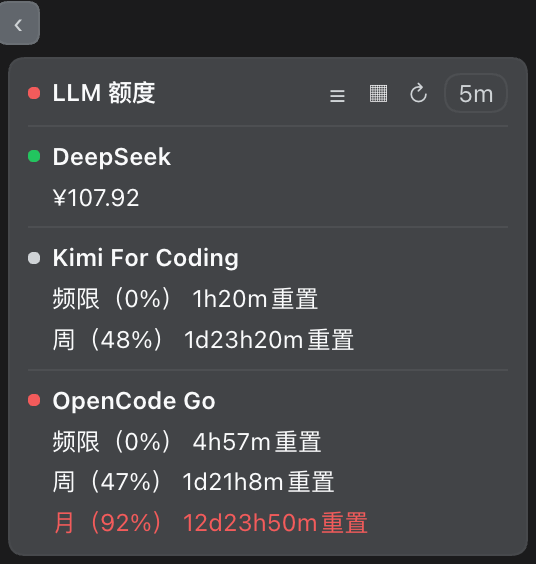

# LLM 用量卡片 · dsh-llm-balance

> DeepSeek Harness 插件：在界面右下角放一张小卡片，随时告诉你接入的 AI 账号**还剩多少钱、还剩多少额度**。



大模型用起来很顺，可「这个月还剩多少额度」「是不是快欠费了」总得一个个去官网翻。这张卡片把这件事收进一个角，扫一眼就知道。

## 它显示什么

- **充值的账号**（DeepSeek、Moonshot）→ 一行**余额金额**，不硬凑百分比
- **订阅 / 套餐账号**（Kimi For Coding、OpenCode Go）→ 每个窗口一行**已用百分比**和**多久后重置**，比如 `频限（47%） 3d0h0m重置`
- **颜色替你判断**：剩余不足 **20% 变红**、不足 **40% 变黄**，其余蓝色；当前正在用的那个提供商带一个**绿点**

| 服务商 | 类型 | 显示 |
|---|---|---|
| DeepSeek | 充值 | 余额 |
| Moonshot（Kimi 开放平台） | 充值 | 余额 |
| Kimi For Coding | 订阅 | 频限 + 周窗口 |
| OpenCode Go | 订阅 | 频限 / 周 / 月 |

只接入其中几个，就只显示这几个；全部接入，就全部显示，不会莫名少一个。

## 安装

在 DSH 的插件市场里搜「用量」或「balance」一键安装；也可以在命令行：

```sh
dsh plugin --profile web add dsh-llm-balance
```

装好后刷新网页即可。**凭据不用额外配**：插件会顺着你已经填好的 API Key 自己找到对应账号。

## 怎么用

- **切换视图**：点标题右侧第一个图标，在「当前模型 → 整体汇总 → 全部来源」之间循环
- **拖动**：按住标题整行拖，靠近左右边缘会自动**磁吸**贴边；双击标题回到右下角
- **收成气泡**：贴边后卡片角上会出现 `‹` / `›`，点一下只留当前提供商的首字母 + 一个关键数字；点气泡任意位置恢复
- **改刷新频率**：点 `60s` 芯片，可选 60 秒 / 5 分钟 / 30 分钟 / 1 小时
- **半透明**：点 `▦` 让底色变淡，文字始终清晰
- 视图、位置、折叠状态、刷新频率都会记住，下次打开还是老样子

## 颜色怎么算

- 订阅窗口显示**已用 %**，但颜色看**剩余 %** —— 所以「已用 92%」是红的，因为只剩 8%
- 余额没有「总量」这个分母，所以不硬凑百分比；想提醒就给余额设个**金额阈值**（见下）

## 常用配置（全部可选）

不改也能直接用。写在 `cordis.patch.yml` 那一行的 `config:` 里，改完重启 `dsh web` 生效：

```yaml
config:
  thresholds: { warn: 40, error: 20 }                    # 剩余低于 40% 黄、低于 20% 红
  balanceThresholds:
    'deepseek-balance:CNY': { warnBelow: 40, errorBelow: 20 }   # DeepSeek 余额：低于 40 元黄、20 元红
  percentMode: used                                      # 显示已用%（改成 left 显示剩余%）
  refreshMs: 60000                                       # 默认 60 秒刷新一次
```

更细的选项（换端点、凭证读取顺序、`sources` 显式列表、Kimi 登录态等）见 [docs/CONFIG.md](docs/CONFIG.md)。

## 隐私

密钥只留在宿主进程里：浏览器端拿到的只有金额、币种、窗口时长和错误码，接口只读、不缓存。插件只查询你**已经接入**的账号，不会去扫本机其它凭证。

## 想加一个服务商？

一个文件就能加一个提供商，见 [docs/CONTRIBUTING.md](docs/CONTRIBUTING.md)。

## License

MIT
